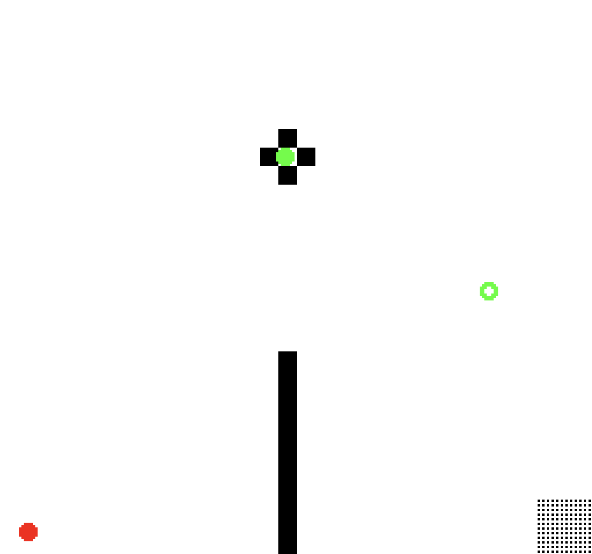
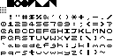

# (TODO: your game's title)

### Author: Russell Emerine

### Design: 
(TODO: In two sentences or fewer, describe what is new and interesting about your game.)

### Screen Shot:

### How Your Asset Pipeline Works:

The tiles are read from a single `atlas.png` file:

Most of the tiles are a font drawn in GIMP, very loosely inspired by
[damieng's Space Opera](https://damieng.com/typography/zx-origins/space-opera/).
The tiles are numbered left to right, top to bottom.
Due to the game's simple color scheme, only two colors are needed to encode the tiles.

The tiles are ordered so that text characters coincide with their ASCII numbers.
`atlas.png` is loaded in, and each tile is read pixel by pixel.
This only happens once, since all game modes use the same tiles.

(TODO: describe the steps in your asset pipeline, from source files to tiles/backgrounds/whatever you upload to the PPU466.)

(TODO: make sure the source files you drew are included. You can [link](your/file.png) to them to be a bit fancier.)

How To Play:

(TODO: describe the controls and (if needed) goals/strategy.)

This game was built with [NEST](NEST.md).

